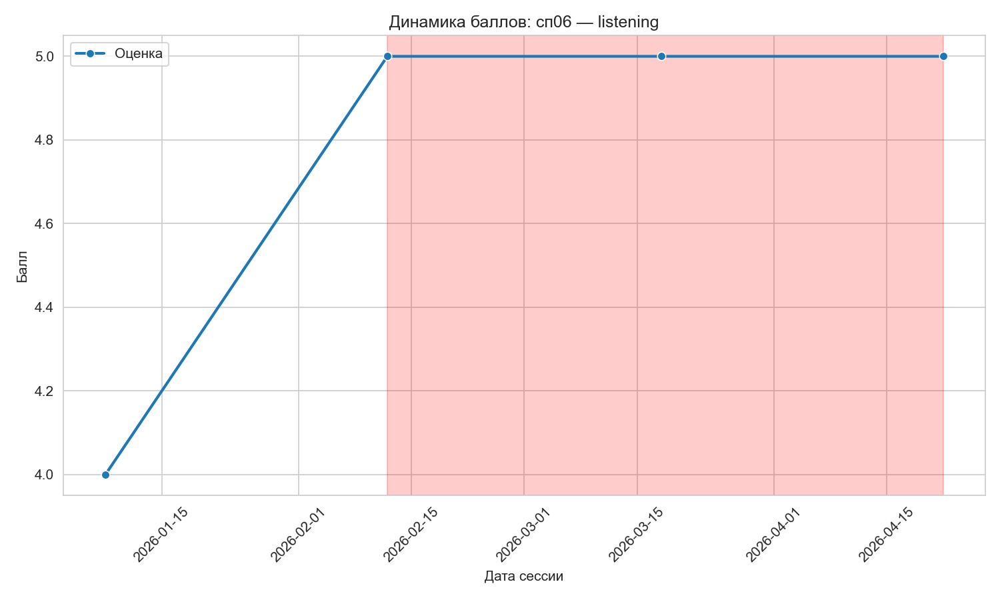
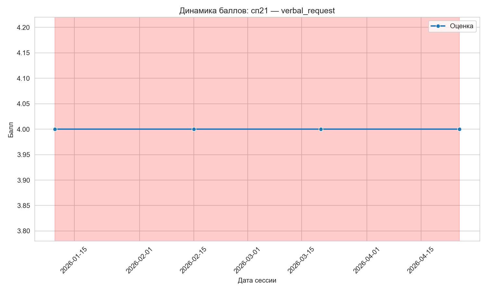

# test-sber-ras-2026

Тестовое задание для отбора на позицию Junior Data Scientist.  
Реализация пайплайна анализа диагностических данных детей с РАС: валидация, поиск застоя прогресса, генерация отчётов и графиков. Проект включает тесты и документацию.

## Содержание

- [Требования](#требования)
- [Установка и запуск](#установка-и-запуск)
- [Структура проекта](#структура-проекта)
- [Архитектура решения](#архитектура-решения)
- [Используемые технологии](#используемые-технологии)
- [Компромиссы и допущения](#компромиссы-и-допущения)
- [Проверка работы](#проверка-работы)
- [Примеры использования CLI](#примеры-использования-cli)

## Требования

- Python 3.8 или выше
- Виртуальное окружение (рекомендуется `venv`)
- Входной файл `children_sessions.xlsx` (не включён в репозиторий, необходимо поместить в `data/`)

## Установка и запуск

### Способ 1: Локально с виртуальным окружением (рекомендуемый)

1. **Клонируйте репозиторий**
   ```bash
   git clone https://github.com/yourusername/test-sber-ras-2026.git
   cd test-sber-ras-2026
   ```

2. **Создайте и активируйте виртуальное окружение**
    ```bash
    python -m venv venv
    source venv/bin/activate      # Linux/macOS
    venv\Scripts\activate         # Windows
    ```

3. **Установите зависимости**

    ```bash
    pip install -r requirements.txt
    ```

4. **Поместите данные**

    Скопируйте файл children_sessions.xlsx в папку data/.

5. **Запустите анализ**

    ```bash
    python main.py --input data/children_sessions.xlsx
    ```

    Или в интерактивном режиме:

    ```bash
    python main.py --interactive
    ```
    
    Результаты появятся в папке output/:

    - stagnation_report.csv (или .xlsx) – таблица с периодами застоя.

    - summary.md – текстовый отчёт для супервизора.

    - plots/ – графики динамики для наиболее рискованных кейсов.

### Способ 2: Через Docker (опционально)

1. Соберите образ

    ```bash
    docker build -t sber-ras-analyzer .
    ```

2. Запустите контейнер с пробросом папок

    ```bash
    docker run --rm \
        -v "$(pwd)/data:/app/data" \
        -v "$(pwd)/output:/app/output" \
        sber-ras-analyzer \
        --input data/children_sessions.xlsx --output output/
    ```

    Для интерактивного режима добавьте флаг -it

    ```bash
    docker run --rm -it \
        -v "$(pwd)/data:/app/data" \
        -v "$(pwd)/output:/app/output" \
         sber-ras-analyzer \
        --interactive
    ```

## Структура проекта

```tree
test-sber-ras-2026/
├── data/                    # Входные данные (не в репозитории)
│   └── children_sessions.xlsx
├── output/                  # Результаты анализа (создаётся автоматически)
├── src/                     # Исходный код
│   ├── __init__.py
│   ├── config.py            # Конфигурация и допустимые значения
│   ├── loader.py            # Загрузка и валидация данных
│   ├── stagnation.py        # Логика обнаружения застоя
│   ├── report_generator.py  # Генерация отчётов и графиков
│   └── cli.py               # Интерфейс командной строки (CLI)
├── tests/                   # Unit-тесты
│   ├── __init__.py
│   ├── test_loader.py
│   ├── test_stagnation.py
│   └── test_report_generator.py
├── main.py                  # Точка входа для запуска CLI
├── requirements.txt         # Зависимости
└── README.md                # Документация
```

## Архитектура решения

Пайплайн обработки данных состоит из трёх основных этапов:

1. Загрузка и очистка (loader.py)

    - Чтение Excel-файла.

    - Валидация обязательных колонок.

    - Исправление ошибок ввода (например, смещённый specialist_type в progress_flag).

    - Приведение к единому регистру, исправление опечаток через маппинги из config.py.

    - Проверка диапазона баллов (1–10).

    - Приведение типов (даты, категории).

    - Удаление строк с пропущенными критическими данными.

2. Анализ застоя (stagnation.py)

    - Группировка данных по child_id и domain.

    - Расчёт временных дельт и изменений баллов между сессиями.

    - Поиск последовательных периодов без роста баллов длительностью ≥ min_days (по умолчанию 28 дней).

    - Назначение уровня риска (high ≥ 60 дней, medium 42–59 дней, low 28–41 день).

    - Опциональный анализ комментариев на ключевые слова стагнации (флаг --comment-analysis).

3. Генерация отчётов (report_generator.py)

    - Экспорт таблицы застоя в CSV/Excel.

    - Построение графиков динамики для топ-N кейсов (подсветка периодов застоя).

    - Создание summary.md с общей статистикой и деталями по наиболее критичным случаям.

CLI на click объединяет все этапы и предоставляет гибкие настройки через аргументы командной строки либо интерактивный режим.

## Используемые технологии

| Технология | Назначение | Почему выбрана |
|-------------|-------------|-------------|
| Python 3  | Основной язык программирования | Требование задания, богатая экосистема для анализа данных |
| pandas  | Работа с табличными данными | Де-факто стандарт для ETL и анализа, чётко указан в стеке |
| numpy  | Числовые операции | Используется pandas, явно указан в стеке |
| pytest  | Unit-тестирование | Простой и мощный фреймворк, требование задания |
| matplotlib + seaborn  | Визуализация | Построение информативных графиков динамики, требование задания |
| click  | Интерфейс командной строки | Лёгкий и гибкий CLI с поддержкой интерактивных подсказок |
| openpyxl  | Чтение/запись Excel | Необходим для работы с .xlsx |

## Компромиссы и допущения

1. Обработка пропусков

    Строки с отсутствующими child_id, domain или session_date удаляются, так как они критичны для анализа. Пропуски в баллах также приводят к исключению записи из расчёта дельт.

2. Формат даты

    Предполагается, что даты в исходном файле записаны в формате ДД.ММ.ГГГГ. Явное указание format='%d.%m.%Y' устраняет неоднозначности.

3. Уровни риска

    Границы (28, 42, 60 дней) выбраны на основе типичных интервалов между занятиями и практики мониторинга. Их можно изменить через конфиг или параметры.

4. Анализ комментариев

    Ключевые слова выделены эмпирически на основе предоставленных данных. Для повышения точности список можно расширить (лежит в config.py).

## Проверка работы

### Запуск тестов

Все модули покрыты unit-тестами. Для запуска выполните:

``` bash
pytest tests/ -v
```

### Валидация отчёта

После выполнения основного скрипта проверьте содержимое папки output/:

- stagnation_report.csv – должен содержать колонки: child_id, domain, start_date, end_date, duration_days, start_score, end_score, comments, risk_level. При включённом --comment-analysis добавляются stagnation_indicators и has_stagnation_comment.

- summary.md – содержит сводную статистику и описание топ-кейсов.

- plots/ – графики в формате PNG с линией баллов и подсвеченными зонами застоя (если найдены).

## Примеры использования CLI

### Базовый запуск

``` bash
python main.py --input data/children_sessions.xlsx
```

``` text
Загрузка данных из data/children_sessions.xlsx...
INFO: Загружено 102 записей из data/children_sessions.xlsx
INFO: Проверка колонок пройдена
WARNING: Обнаружено 87 случаев, где specialist_type ошибочно записан в progress_flag. Выполняется перенос.
INFO: После очистки осталось 102 записей
Анализ застоя (min_days=28)...
Найдено периодов застоя: 12
Генерация отчётов в output...
INFO: CSV отчёт сохранён: output/stagnation_report.csv
INFO: График сохранён: output/plots/СП02_Listening_dynamics.png
INFO: Текстовый отчёт сохранён: output/summary.md
Готово!
Внимание: обнаружено 2 кейсов с высоким риском.
```

### Указание выходной директории и параметров

``` bash
python main.py -i data/children_sessions.xlsx -o results/ --min-days 30 --top-n 10 --formats both
```

### Включение анализа комментариев

``` bash
python main.py -i data/children_sessions.xlsx --comment-analysis
```

### Интерактивный режим (без аргументов)

``` bash
python main.py --interactive
```

### Просмотр справки

``` bash
python main.py --help
```

``` text
$ python main.py --help
Usage: main.py [OPTIONS]

  Запускает полный пайплайн анализа данных:
  1. Загрузка и валидация входного Excel-файла.
  2. Поиск периодов застоя (функция detect_stagnation).
  3. Генерация отчётов: CSV/Excel, графики динамики, summary.md.

Options:
  -i, --input PATH       Путь к входному Excel-файлу (обязательно).
  -o, --output PATH      Директория для результатов [default: output]
  --min-days INTEGER     Минимальная длительность застоя в днях [default: 28]
  --top-n INTEGER        Количество кейсов для построения графиков [default: 5]
  --formats [csv|excel|both] Формат табличного отчёта [default: csv]
  --comment-analysis / --no-comment-analysis Анализ комментариев на ключевые слова
  -I, --interactive      Запустить в интерактивном режиме
  --help                 Показать эту справку
```

### Примеры сгенерированных графиков



